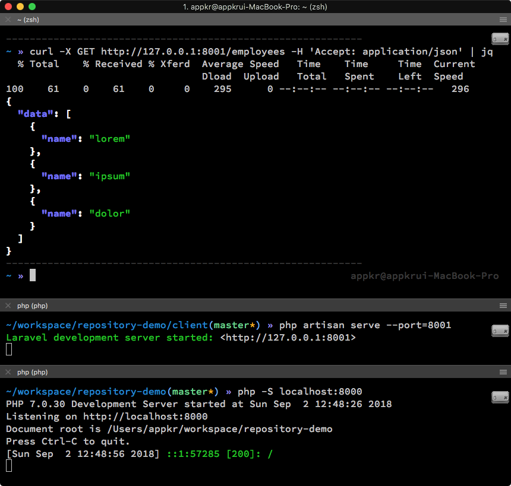
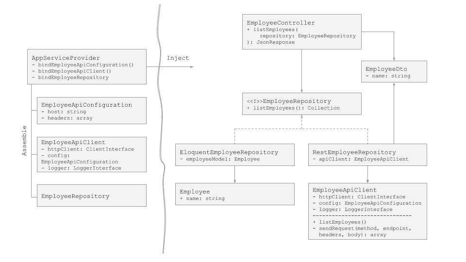

## Step-by-step Repository Pattern Demo

이 프로젝트를 저장소 패턴을 도입하면서 프로젝트의 구조가 점진적으로 변하는 모습을 보여줍니다. 커밋 이력을 쫒아가면 변경분을 확인할 수 있습니다.

- 전통적인 DB(엘로퀀트 모델)를 이용해서 직원 데이터를 제공하는 서비스로 시작
- 저장소(Repository) 패턴으로 엘로퀀트를 랩핑
- 엘로퀀트 대신 `file_get_contents`를 사용하는 원격 API로부터 직원 데이터 공급받는 서비스로 진화
- 환경 변수를 이용한 환경 분리 (eg. dev, qa, prod ...)
- `file_get_contents` 대신 `Guzzle`로 원격 API 클라이언트 구현 교체

### 실행하기

프로젝트를 복제합니다.

```bash
$ git clone git@github.com:appkr/repository-demo
```

프로젝트를 실행하기 위한 기본 준비를 합니다.

```bash
(repository-demo) $ cd client
(repository-demo/client) $ cp .env.example .env 
(repository-demo/client) $ cp composer install 
(repository-demo/client) $ touch database/database.sqlite 
(repository-demo/client) $ php artisan migrate
```

API 클라이언트 -> 라라벨 서비스(`http://localhost:8001`) -> 직원 API 서비스(`http://localhost:8000`) 구조를 갖습니다.

역할|명령어
---|---
API 클라이언트|`curl -X GET http://127.0.0.1:8001/employees -H 'Accept: application/json'`
라라벨 서비스|`(repository-demo/client) php artisan serve --port=8001`
직원 API 서비스|`(repository-demo) $ php -S localhost:8000`



### Class Diagram

- 화살표의 방향은 의존의 방향입니다.
- 저장소 패턴을 도입함으로써, 이 예제 프로젝트에서 `EmployeeController`는 `EmployeeRepository` 인터페이스와 `EmployeeDto` 데이터 객체에만 의존하며, `Employee` 엘로퀀트 모델 및 `EmployeeApiClient`와 같은 상세 구현과는 완전히 절연됨을 볼 수 있습니다.



### Sponsor

[Jetbrains](https://www.jetbrains.com/) 사에서 IntelliJ IDE를 제공해주셨습니다.


